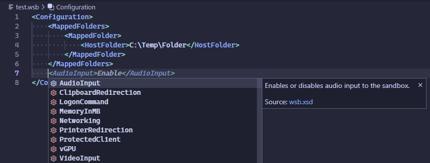

# Windows Sandbox Configuration

Visual Studio Code extension for authoring *.wsb configuration files for Windows Sandbox.

## Features

- Schema validation
- Documented settings and options
- Completions
- Syntax highlighting
- XML language features provided by Red Hat's [XML](https://marketplace.visualstudio.com/items?itemName=redhat.vscode-xml) extension, incl. comments, folding etc.

## Requirements

This extension depends on Red Hat's [XML](https://marketplace.visualstudio.com/items?itemName=redhat.vscode-xml) extension for language server features.

## Usage

1. Install the extension
2. Create or open a new *.wsb file
3. The language should be auto-detected as Windows Sandbox
4. Start writing or trigger code completion.
